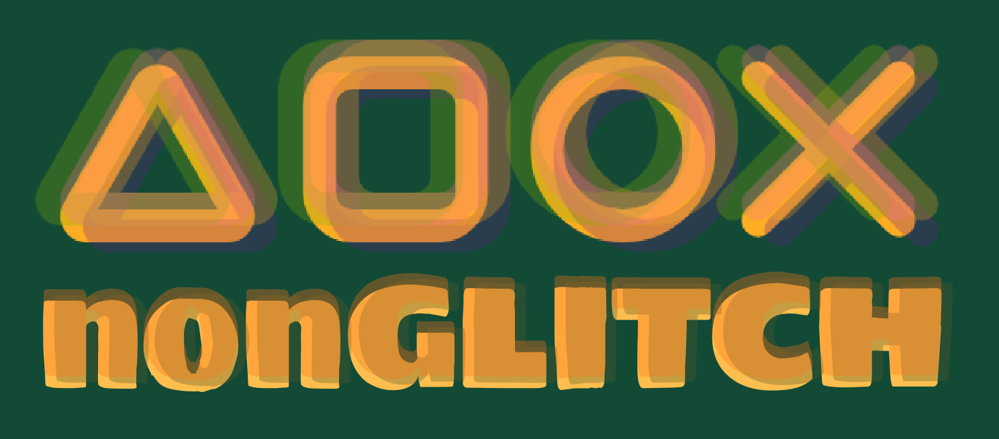

# Blok Tech :technologist:

Hello there, thank you for visiting my repository! I'm excited to have you here and want to provide you with all the information you need to get started.

First of all, this project provides a login, sign up and delete account feature within a matching application. If you want to learn about my research and project feel free to check [Wiki](https://github.com/Sensinki/Blok-tech/wiki).

# Table of Contents :mag:
Description 
Installation
Tools
License
Sources

# Description :memo:
Since gamers are always at the computer, they may have difficulty finding friends outside of the game. nonGLITCH provides to make sure they find a friend to spend time with while playing games. 

The concept of nonGLITCH is that gamers can match with each other and find enjoyable gamer friends to enjoy with. The focus of this project is on the feature where users have to sign up and log in.

# Installation :package:
- How do I get started?
### 1. Create a folder
That helps you to place this project in your computer so you can easily navigate through it. 
### 2. Clone this repository 
You can clone the application from CLI or install it by downloading the ZIP file. To clone, you can paste the following code into the CLI you are using:

`gh repo clone Sensinki/Blok-tech`

### 3. Install dependencies
Now you have all documents but you can not run the code without dependencies. I used npm, you can install npm by copying the following code to the CLI.

You can check my "package.json" file if you want to see all of my dependensies and devDependensies.

`npm install`

### 4. Run the project
Now you can run the project. Write your terminal `npm start`. 

To check the connection you can go to your browser and write "localhost:3000". If there is no problem, you should see the nonGLITCH welcome screen.

### 5. .env file 
As last final step, you should set your .env file for MongoDB connection. In the .env file you will define following informations:

`DB_URI= <your MongoDB URI>`

`DB_USERNAME= <your username>`

`DB_PASSWORD= <your database password>`

`DB_NAME= <your database name>`

`SESSION_SECRET=<your secret password>`

# License :page_facing_up:
This project is using [MIT Licence](https://github.com/Sensinki/Blok-tech/blob/main/Project%20Tech/LICENCE)

# Sources :globe_with_meridians:
You can get more help from the following tools.
* [Git](https://git-scm.com/)
* [Npm](https://www.npmjs.com/)
* [Node.js](https://nodejs.org/en)
* [Handlebars](https://handlebarsjs.com/)
* [Mongoose](https://mongoosejs.com/)
